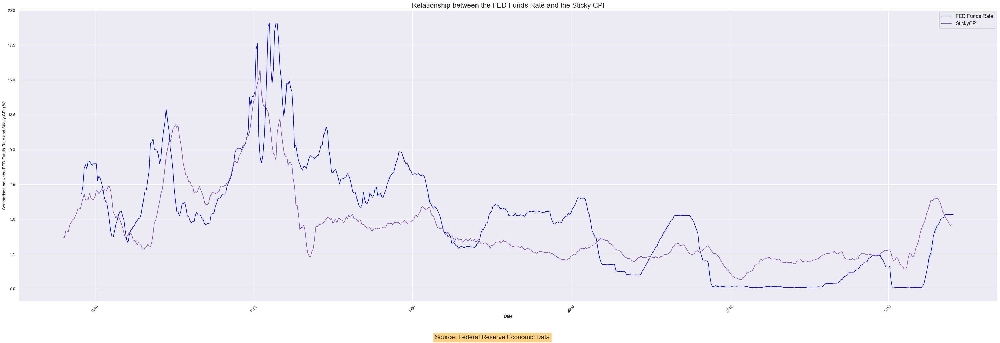

<h1 style="text-align:center;">Macro Report - United States</h1>

<h2 style="text-align:center;">Gabriel de Macedo Santos</h2>

<h3 style="text-align:center;">Macroeconomic Scenario <strong>United States</strong></h3>

### American Consumer Price Index (CPI)

&emsp;&emsp;The preceding weeks have been characterized by a notable resurgence in inflationary pressures, most notably evidenced by the reinvigoration of the Consumer Price Index (CPI). This resurgence has introduced a degree of uncertainty into the trajectory of American disinflation, diverging from the anticipated path delineated by recent trends. The unexpected movement in the CPI stands in contrast to the downward momentum in inflationary forces observed over the preceding six-month period, thereby catching the Federal Reserve (FED) off guard.

&emsp;&emsp;The Federal Reserve, having previously signaled a cautious optimism regarding the prospects of continued disinflation, is now confronted with the challenge of recalibrating its monetary policy stance in response to this unforeseen inflationary uptick. In light of this development, the likelihood of interest rate cuts in the imminent March deliberations is zero, as the FED reevaluates its policy toolkit in alignment with prevailing economic realities.

&emsp;&emsp;Moreover, the current juncture warrants diligent scrutiny of forthcoming communications from key figures within the Federal Reserve. Insights gleaned from these deliberations will afford stakeholders a deeper understanding of the nuanced considerations informing the FED's policy calculus amidst evolving market dynamics. Consequently, market participants are advised to maintain a watchful stance, attuned to any indications regarding the FED's assessment of the inflationary landscape and its implications for monetary policy normalization.

&emsp;&emsp;Furthermore, it is imperative to underscore the global ramifications of the American CPI dynamics. Given the interconnected nature of financial markets, fluctuations in the CPI reverberate across international borders, exerting influence on investor sentiment and asset valuations worldwide. Accordingly, prudent investors are advised to factor in the ramifications of the CPI developments within their broader investment strategies, cognizant of the interconnectedness of global financial markets.

### Sticky CPI

&emsp;&emsp;Another pivotal indicator reflecting inflationary pressures is the Sticky CPI, which tracks prices less prone to immediate adjustments in the market. These "sticky" prices are characterized by their slower response to changes in supply and demand dynamics, often influenced by long-term contracts, government regulations, or other factors that impede swift price alterations. In essence, the Sticky CPI offers a lens into the segment of prices that exhibit less volatility, providing insights into underlying inflation trends.

&emsp;&emsp;Examining the Sticky Price Consumer Price Index less Food and Energy, we observe a nuanced trajectory over recent months. Despite experiencing a downward trend in preceding months, the index registered a marginal uptick in January, edging up from 4.55 to 4.6. This modest increase underscores the resilience of certain price segments, suggesting persistent inflationary pressures despite broader market fluctuations. It signifies that while some sectors may witness price declines, others remain steadfast, contributing to overall inflationary momentum.

&emsp;&emsp;It's noteworthy that despite the recent fluctuations, the Sticky CPI continues to hover at elevated levels compared to the pre-pandemic era. This sustained elevation underscores the enduring impact of structural factors driving inflation, including supply chain disruptions, labor market dynamics, and shifts in consumer behavior. Consequently, while headline inflation metrics may exhibit variability, the Sticky CPI underscores the underlying inflationary forces that persist in the economy.

&emsp;&emsp;Against this backdrop, the trajectory of the Sticky CPI assumes heightened significance for monetary policymakers, particularly the Federal Reserve (FED). As the FED navigates its dual mandate of fostering maximum employment and price stability, the Sticky CPI offers nuanced insights into the underlying inflation dynamics, guiding policy deliberations. With the Sticky CPI remaining at elevated levels, it presents an additional consideration for the FED, potentially influencing decisions regarding monetary policy adjustments.

&emsp;&emsp;Examining this graph provides insights into the correlation between the Sticky CPI and the FED Funds Rate. By analyzing historical data, the Federal Reserve can anticipate how this correlation may persist, aiding in forecasting future economic conditions and guiding monetary policy decisions effectively.

### M2

&emsp;&emsp;M2 is a crucial metric for comprehending the monetary circulation within a given economy. It encompasses M1 along with (1) savings deposits, including money market deposit accounts; (2) small-denomination time deposits (time deposits of less than $100,000), excluding individual retirement account (IRA) and Keogh balances at depository institutions; and (3) balances in retail money market funds (MMFs), excluding IRA and Keogh balances at MMFs.

&emsp;&emsp;Understanding this, it can be asserted that throughout various periods of history, M2 may reflect on the trajectory of inflation within a particular country, as there might be more money circulating within the market than the demand for that currency necessitates. In recent years, the American M2 has experienced a significant increase compared to previous years in the US. This surge in M2 was preceded by an increase in the American Consumer Price Index (CPI). Currently, the American M2 stands at $20,916.575 billion, reaching one of the highest levels ever recorded.

&emsp;&emsp;The American M2 achieved its historic high several months ago and had been retracting in small increments, but since November 2023, the index has started to advance slightly. This slight increase may evoke concerns regarding the initiation of monetary tightening by the Federal Reserve.

&emsp;&emsp;This uptick in the M2 index since November 2023 may prompt apprehension regarding the Federal Reserve's potential initiation of monetary tightening measures. Such concerns stem from the fact that an expanding money supply, as indicated by the rise in M2, can fuel inflationary pressures within the economy. As the Federal Reserve aims to maintain price stability and moderate inflation, any signs of sustained growth in the M2 measure could influence policymakers to consider tightening monetary policy. This could involve actions such as raising interest rates or reducing the money supply to curb inflationary trends. Consequently, market participants closely monitor M2 movements as a key indicator of potential shifts in monetary policy direction by the Federal Reserve, which can have significant implications for financial markets and the broader economy

### Federal Debt Total Public Debt

&emsp;&emsp;Total Public Federal Debt is a critical indicator that reflects the total amount of financial obligations assumed by the federal government towards various creditors. This metric covers a variety of financial instruments, including Treasury bills, notes, and bonds, used by the government to finance its activities and programs.

&emsp;&emsp;The burgeoning U.S. public debt exerts multifaceted effects on the American economy, with implications spanning fiscal policy, monetary policy, and overall economic stability. As the debt-to-GDP ratio climbs to historic highs, concerns arise regarding the sustainability of government finances, the potential for crowding out private investment, and the risk of fiscal crises.

&emsp;&emsp;Currently, American debt stands at approximately 120% of the country's Gross Domestic Product (GDP), marking one of the highest levels in recorded history. Furthermore, the absolute value of the American debt in terms of dollars represents the highest nominal debt in U.S. history.

&emsp;&emsp;Firstly, the escalating public debt constrains the government's fiscal flexibility, limiting its capacity to respond to economic downturns and unforeseen emergencies. With a significant portion of federal revenue allocated towards servicing debt obligations, resources available for critical investments in infrastructure, education, and healthcare become increasingly constrained. This curtails long-term economic growth prospects and exacerbates structural inequalities within society.

&emsp;&emsp;Furthermore, the ballooning public debt amplifies macroeconomic vulnerabilities, heightening the risk of fiscal crises and sovereign defaults. Elevated debt levels increase the government's reliance on external creditors, rendering the economy susceptible to shifts in investor sentiment and global financial conditions. A loss of investor confidence could precipitate capital flight, currency depreciation, and rising borrowing costs, undermining economic stability and eroding the nation's creditworthiness on the international stage.

&emsp;&emsp;In response to these challenges, the Federal Reserve plays a pivotal role in managing the economic fallout of burgeoning public debt. Recognizing the interplay between fiscal and monetary policy, the Fed closely monitors developments in the debt markets, assessing the potential implications for inflation, interest rates, and overall economic performance.

&emsp;&emsp;While the Fed maintains its independence from fiscal authorities, it employs a range of policy tools to mitigate the adverse effects of rising public debt on the economy. Through open market operations, interest rate adjustments, and forward guidance, the Fed aims to foster price stability, support full employment, and promote sustainable economic growth amidst fiscal uncertainty.

&emsp;&emsp;However, the efficacy of monetary policy in offsetting the effects of mounting public debt is not without limits. As debt levels escalate, the room for maneuvering becomes increasingly constrained, limiting the Fed's ability to respond to economic shocks and financial market disruptions. Consequently, policymakers face mounting pressure to address the root causes of escalating public debt through comprehensive fiscal reforms aimed at enhancing revenue generation, containing spending growth, and promoting long-term fiscal sustainability.

&emsp;&emsp;In conclusion, the ballooning U.S. public debt poses formidable challenges to the economy, necessitating a coordinated and proactive response from fiscal and monetary authorities. By understanding the complex interplay between debt dynamics and economic outcomes, the Federal Reserve remains vigilant in safeguarding price stability and financial stability, thereby fostering resilience and prosperity in the face of fiscal uncertainties.

### Unemployment Rate

&emsp;&emsp;To analyze American unemployment, four key age-related data metrics are pivotal for understanding the country's economic behavior:

#### Unemployment Rate 25 - 34 Years:

&emsp;&emsp;This age group typically includes individuals who are graduating from college, entering their chosen career fields, and beginning to solidify their career paths. Unemployment rates in this demographic can signal a lack of confidence in the final economic, political, or monetary landscape, as companies may be hesitant to hire less experienced individuals perceived to have lower productivity compared to more established professionals.

&emsp;&emsp;Recent data shows a decrease in unemployment rates for individuals aged 25 to 34, dropping from 4.2% in December 2023 to 3.9% in January 2024. This trend of decreasing unemployment rates was also observed in January, February, May, June, October, and November of 2023, despite not being in the best fiscal and monetary condition in the American scenario.

&emsp;&emsp;Historically, before the 2000s, the relationship between the FED Funds Rate and the unemployment rate for younger people was relatively proportional, meaning that monetary tightening had more pronounced consequences within this population segment. However, following the dot-com bubble in the 2000s, the unemployment rate increased significantly, while the FED Funds Rate did not mirror this movement. A similar discrepancy was observed during the subprime mortgage crisis in 2008, where unemployment spiked significantly as the FED pursued a monetary easing policy, creating another mismatch in this pattern. The most recent occurrence of this event was during the COVID-19 pandemic, where unemployment rates increased while the economic policy was also geared towards monetary easing and a significant increase in debt.

&emsp;&emsp;Currently, the unemployment rate among this age group is close to the pre-pandemic period but is not considered stabilized by some economists.

#### Unemployment Rate 45 - 54 Years:

&emsp;&emsp;This demographic represents individuals with established careers and those who have recently entered leadership positions, making unemployment less likely within this age group. However, unemployment rates for workers aged 45 to 54 can be affected by various factors, including structural changes in the economy, technological advancements, and workplace age discrimination. In industries undergoing rapid automation or restructuring, older workers may face challenges in finding new employment due to a lack of specific skills needed for new job opportunities. Additionally, age-based discrimination can lead to higher unemployment rates among older workers as companies may prefer hiring younger candidates, perceived as more adaptable or less likely to demand higher wages.

&emsp;&emsp;Unlike the unemployment rate for the 25-34 age group, the unemployment rates for individuals aged 45-54 have increased over the past year, reaching levels not seen since November 2022, but exceeded in September 2023 with a rate of 2.8%.

&emsp;&emsp;Despite this slight increase in recent months, the unemployment rate has returned to pre-pandemic levels, attempting to stabilize within the 2% to 3% range.

#### Unemployment Rate 55 - 64 Years:

&emsp;&emsp;The unemployment rate for individuals aged 55 to 64 is particularly insightful when assessing the economic landscape's influence on seasoned professionals with well-established careers and leadership roles. This demographic typically encompasses individuals nearing retirement, yet many remain actively engaged in the workforce, contributing significantly to their respective industries.

&emsp;&emsp;The data spanning from January 2022 to January 2024 reveals nuanced fluctuations in the unemployment rate within this age group, shedding light on broader economic trends and their impact on seasoned workers. Initially, in January 2022, the unemployment rate stood at 3.4%, reflecting a stable employment landscape for this demographic. Over the course of the year, a general trend of decline was observed, reaching a low of 2.0% in November 2022, indicative of a robust demand for the experience and expertise that workers in this age group bring to the workforce.

&emsp;&emsp;However, this trend did not maintain a steady decline; fluctuations were noted throughout the period, with rates oscillating between 2.2% and 2.9% from the beginning of 2023 to January 2024. The most recent data from January 2024 shows an unemployment rate of 2.8%, suggesting a slight uptick in unemployment among this demographic. Such variations can be attributed to several factors, including economic shifts, industry-specific trends, and changes in the labor market dynamics affecting the employment opportunities available to older workers.

&emsp;&emsp;The analysis of unemployment rates for individuals aged 55 to 64 is crucial for several reasons. Firstly, it provides insights into the economic health and stability of the labor market, especially for those in the later stages of their careers. Secondly, it highlights the resilience and adaptability of older workers in navigating changing economic conditions. Finally, understanding these trends can help policymakers and business leaders to devise strategies that support the continued engagement of older workers in the workforce, recognizing their valuable contributions and addressing any barriers to their employment.

&emsp;&emsp;For a comprehensive analysis, it's beneficial to visualize these trends through a graph. By plotting the unemployment rates from January 2022 to January 2024, one can observe the subtle yet significant changes over time, offering a clearer picture of the labor market dynamics affecting this age group. The graph serves as a powerful tool to illustrate the fluctuating nature of unemployment rates and to foster a deeper understanding of the economic factors at play.

#### Unemployment Rate 65 Years and Over

&emsp;&emsp;Analyzing the unemployment rate for individuals aged 65 and over is critical for understanding the dynamics of the labor market affecting the oldest segment of the workforce. This demographic consists of individuals who are generally considered to be beyond the traditional retirement age but who may choose to remain employed or seek employment for various reasons, including financial necessity, a desire for continued engagement in professional activities, or the lack of sufficient retirement savings.

&emsp;&emsp;From January 2022 to January 2024, the unemployment rate for those aged 65 and over exhibited a range of fluctuations, indicating a dynamic employment landscape for older workers. The period began with a rate of 3.5% in January 2022 and saw a general trend of variability, with rates dipping to as low as 2.1% in October 2022 and peaking at 4.0% in January 2024. These fluctuations can be attributed to several factors, such as economic conditions, changes in pension policies, or the evolving needs and preferences of older individuals in the labor market.

&emsp;&emsp;The recent increase to 4.0% in January 2024 suggests a notable uptick in unemployment among this age group, potentially signaling shifts in the labor market dynamics or the broader economy that could be influencing the employment opportunities available to older workers. This trend warrants careful examination to understand the underlying causes and to identify potential strategies for supporting the employment needs of older individuals.

&emsp;&emsp;Adding to this analysis is the observation regarding the impact of American interest rates on the unemployment rate for those aged 65 and over. Historically, interest rates have had a limited direct impact on the employment status of this demographic. This could be due to various factors, including the financial independence of some older individuals, the types of roles they occupy, and the sectors in which they are employed. However, the recent data suggesting a possible correlation between rising interest rates and increasing unemployment rates in this age group marks a departure from previous trends. This development is intriguing and requires further exploration to understand whether this reflects a temporary anomaly or a more significant shift in how economic policies affect the employment of older workers.

#### Comparion between Unemployments Rate

&emsp;&emsp;To comprehend how these elements correlate within the current macroeconomic landscape, it is imperative to discern their contrasts and correlated factors. Therefore, it is essential to elucidate historical unemployment dynamics and present the prevailing disparities for a comprehensive understanding.

1. **25-34 Years vs. 45-54 Years:**
   - The unemployment rate for individuals aged 25-34 has experienced a recent decrease, indicating a positive trend, albeit with slight fluctuations. This demographic represents individuals starting their careers, and decreasing unemployment rates suggest growing confidence in the economic landscape.
   - In contrast, the unemployment rates for individuals aged 45-54 have shown an increase over the past year, reaching levels not seen since November 2022. This suggests challenges within this age group, potentially influenced by factors such as technological advancements and age discrimination in the workplace.

   

2. **25-34 Years vs. 55-64 Years:**
   - While the unemployment rate for individuals aged 25-34 has been decreasing, indicating a relatively stable job market for younger professionals, the rate for those aged 55-64 has seen nuanced fluctuations. This suggests differing economic impacts on these age groups, with younger individuals possibly benefiting from a growing economy while older workers navigate changing employment dynamics.

   

3. **25-34 Years vs. 65 Years and Over:**
   - The unemployment rate for individuals aged 25-34 has shown a recent decrease, reflecting improvements in job market conditions for younger workers. In contrast, those aged 65 and over have experienced fluctuations in unemployment rates, with a notable uptick observed in January 2024. This indicates distinct challenges faced by older workers compared to younger counterparts, potentially influenced by factors such as changes in pension policies and evolving labor market needs.

   

4. **45-54 Years vs. 55-64 Years:**
   - Both age groups, 45-54 and 55-64, have experienced fluctuations in unemployment rates, albeit for different reasons. While individuals aged 45-54 have seen an increase in unemployment rates over the past year, those aged 55-64 have shown nuanced fluctuations, with a slight uptick in January 2024. This suggests varying economic impacts on different stages of the career lifecycle, with factors such as technological advancements and industry-specific trends influencing employment opportunities.

   

5. **45-54 Years vs. 65 Years and Over:**
   - The unemployment rate for individuals aged 45-54 has seen recent increases, indicating challenges within this age group potentially related to technological advancements and workplace age discrimination. In contrast, those aged 65 and over have experienced fluctuations in unemployment rates, with a notable uptick in January 2024. This suggests differing economic challenges faced by these age groups, with potential implications for retirement planning and workforce participation policies.

   

6. **55-64 Years vs. 65 Years and Over:**
   - Both age groups, 55-64 and 65 and over, have experienced fluctuations in unemployment rates, reflecting the dynamic nature of the employment landscape for older workers. While individuals aged 55-64 have shown nuanced fluctuations, with a slight uptick in January 2024, those aged 65 and over have experienced a notable increase in unemployment rates during the same period. This highlights the evolving employment dynamics for older workers and the need for targeted policies to support their workforce participation and economic well-being.

   

&emsp;&emsp;Overall, the comparative analysis underscores the diverse economic challenges faced by different age groups in the labor market, influenced by factors such as technological advancements, workplace discrimination, and broader economic trends. Understanding these dynamics is crucial for policymakers and businesses to develop effective strategies that address the unique needs and vulnerabilities of each age cohort, ensuring a more inclusive and resilient workforce.

### CPI Forecast Model

&emsp;&emsp;In order to forecast the American Consumer Price Index (CPI), five Machine Learning models were developed. The tested models included BayesianRidge, Ridge, LinearRegression, KNeighborsRegressor, and ExtraTreesRegressor. Each of these models employs distinct methodologies for projecting CPI, and to enhance accuracy, the K Neighbors Regressor model was selected. This model projected the American CPI at 2.69512459%, while the current market projection stands at 2.9%.

&emsp;&emsp;To achieve this projection, which closely approximates reality, all previously described variables were considered alongside Commercial and Industrial Loans, All Commercial Banks, Percent Change at Annual Rate. It is essential to discern which variables are most correlated with the target, namely Median CPI.

&emsp;&emsp;In the correlation matrix, positive numbers indicate positive correlations, while negative numbers denote negative correlations.

&emsp;&emsp;The accuracy rate of the training data, standing at 70.73%, elucidates the model's proficiency in correctly predicting outcomes within the training dataset. Essentially, this implies that when the model is tested against known data points used for training, it accurately identifies the correct outcome approximately 7 out of every 10 instances. This metric serves as a pivotal indicator of the model's capability to learn and generalize patterns from the provided dataset. While achieving a 100% accuracy rate is often unrealistic and may indicate overfitting, the attained accuracy of 70.73% suggests a reasonable level of performance, albeit with room for improvement. It underscores the need for further refinement and optimization to enhance the model's predictive accuracy and robustness when applied to unseen data in real-world scenarios.